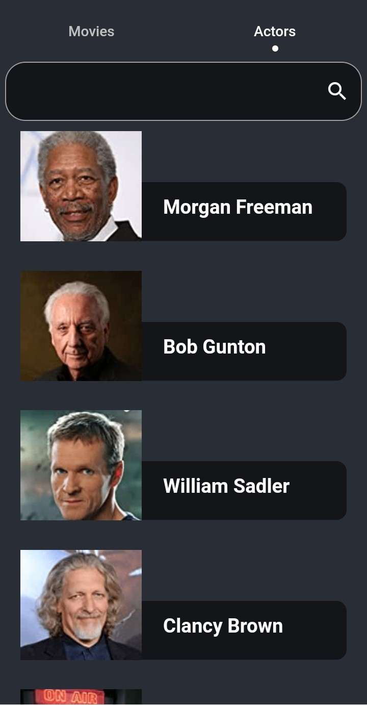

<h1 align="center">movieapp_flutter</h1>

<p align="center">
  

  

  

  <!--  -->

  <!--  -->

  <!--  -->

  <!--  -->
</p>

<!-- Status -->

<!-- <h4 align="center"> 
	🚧  movieapp_flutter 🚀 Under construction...  🚧
</h4> 

<hr> -->

<p align="center">
  <a href="#dart-about">About</a> &#xa0; | &#xa0; 
  <a href="#sparkles-features">Features</a> &#xa0; | &#xa0;
  <a href="#rocket-technologies">Technologies</a> &#xa0; | &#xa0;
  <!-- <a href="#white_check_mark-requirements">Requirements</a> &#xa0; | &#xa0;
  <a href="#checkered_flag-starting">Starting</a> &#xa0; | &#xa0;
  <a href="#memo-license">License</a> &#xa0; | &#xa0; -->
  <a href="https://github.com/FaisalFaraj" target="_blank">Author</a>
</p>

### ScreenShots

<br>




</br>
<br>


</br>

## :dart: About ##

Movie app with Clean-Architecture-Flutter

## :sparkles: Features ##

:heavy_check_mark: modren UI;\
:heavy_check_mark: works on all screens;\
:heavy_check_mark: dark mode support;\
:heavy_check_mark: localization;
:heavy_check_mark: search;
:heavy_check_mark: movie details;
:heavy_check_mark: movie trailer(youtube video);

## :rocket: Technologies ##

The following tools were used in this project:

- [Bloc]
- [Hive]

<!-- ## :white_check_mark: Requirements ##

Before starting :checkered_flag:, you need to have [Git](https://git-scm.com) and [Node](https://nodejs.org/en/) installed.

## :checkered_flag: Starting ##

```bash
# Clone this project
$ git clone https://github.com/FaisalFaraj/movieapp_flutter

# Access
$ cd movieapp_flutter

# Install dependencies
$ yarn

# Run the project
$ yarn start

# The server will initialize in the <http://localhost:3000>
``` -->

## :memo: License ##

<!-- This project is under license from MIT. For more details, see the [LICENSE](LICENSE.md) file. -->


Made with :heart: by <a href="https://github.com/FaisalFaraj" target="_blank">Faisal Faraj</a>

&#xa0;

<a href="#top">Back to top</a>
